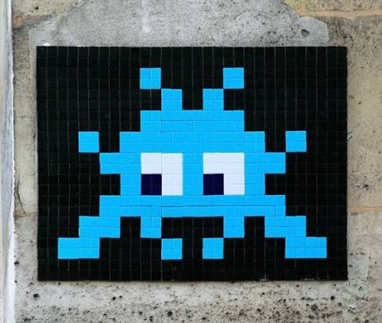
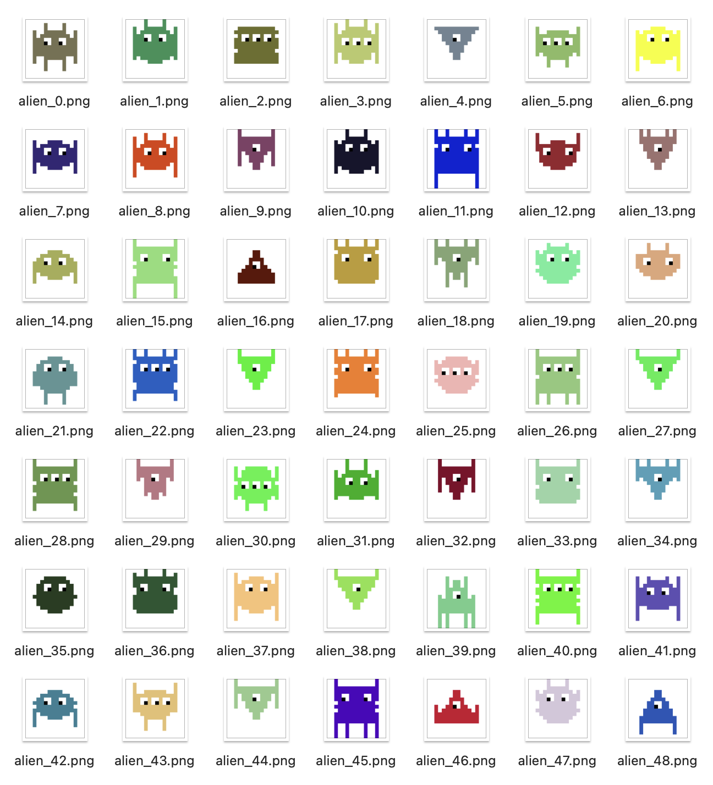
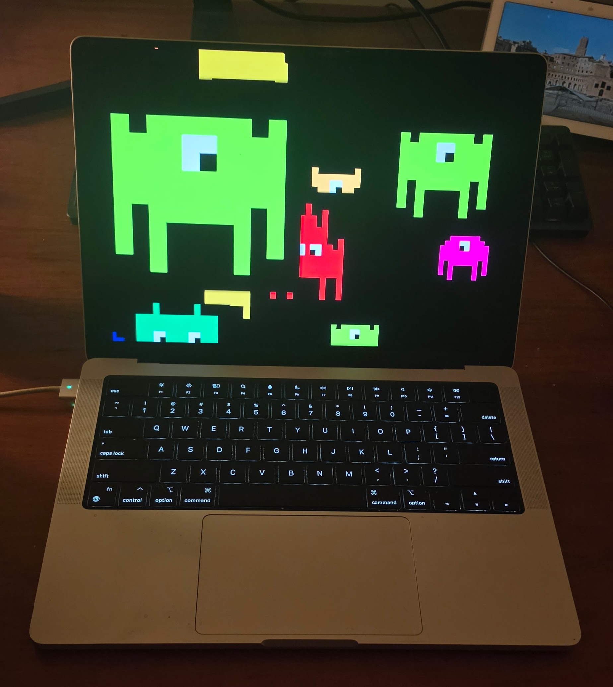
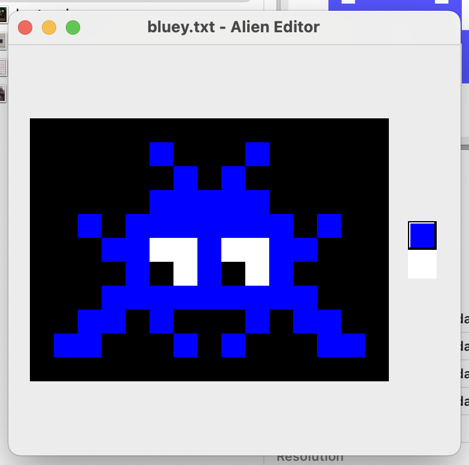
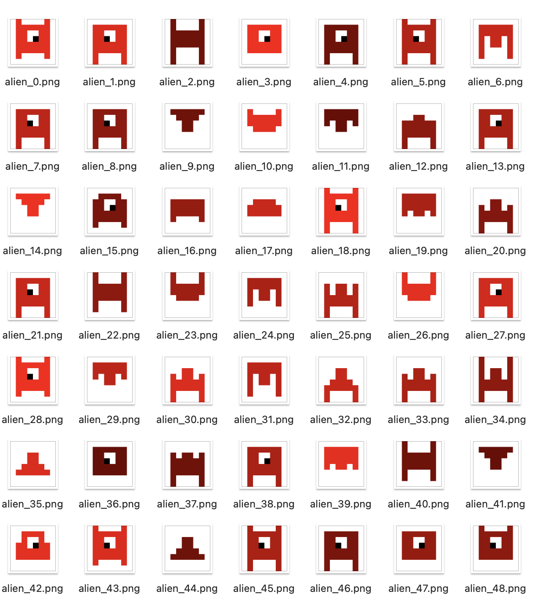

## Alien

### Background

Travelling in Europe over the past few years, I've noticed ceramic mosaic aliens dotted around buildings in cities like Paris and London.

Once you start looking for them, there are a LOT - so I poked around and found there's a French artist that started it all.

[Invader](https://en.wikipedia.org/wiki/Invader_(artist))

They appeal to my geeky computer-based nature, and I've often wanted to write something to generate and animate them.

Then in July 2026 I visited my brother in Finland, and to show him how Claude and agents worked, I got Claude to quickly generate some Python to create these. It worked really well - so once home in New Zealand, it was time to do it again.

## Project structure

I have ideas for using this in various ways - a website, an API, a little Pi driven LED matrix - so I need some reusable code.

### Alien generator

I need an **Alien generator** script, call it `alien_generator.py`. This will take some parameters - the alien DNA - and generate a `JSON` object that represents the image : it will be a list of rows, each row is a list of hex colours representing that pixel. Call the main method `generate_alien()`

I need an **Image painter** script, call it `image_painter.py`. This script will take the `JSON` object created by the generator, and use Pillow to create a `PNG` image of the alien. If a `filename` parameter is also passed in, use that to store the image; otherwise default to `alien.png`

### Body shape

Aliens can have an irregular but symmetrical shape which could be loosely based on a circle, oval, square or triangle (either normal or upside down.)

## Alien DNA

All the DNA parameters will have a default.

### Descriptions

- `width` : width of the image that will be created in pixels, defaults to 16
- `height` : height of the image that will be created in pixels, defaults to 16
- `background` : the hex code of the background, defaults to white `#ffffff`
- `palette` : the palette to use for the alien, there is a list following this section. defaults to `cga`
- `eyes` : an integer for 2 or 3, defaults to 2.
- `bigeyes` : `true` or `false`. if `false` the eyes are a single pixel of white. if `true` the eyes are a 2x2 block of white pixels, with a black pixel in either the left or right bottom pixel.
- `legs` : an integer for the number of vertical legs hanging down. defaults to a random number between 2 and 5.
- `arms` : an integer for the number of vertical arms either sticking up or sticking out to the side. defaults to 0.

We may have to worry about `eyes` fitting into a small image; the same problem with `bigeyes`

### palette colors

- `cga` : the old 16 color palette
- `green` : all shades of green from `#006400` to `#00FF00`
- `red` : all shades of red from `#640000` to `#FF0000`
- `blue` : all shades of blue from `#000064` to `#0000FF`
- `full` : all available RGB colours

There's a likely bug here with `full` and `cga` we could pick a color that matches the background. We should trap this and not allow it.

## Results

### Not bad

This is from a 16x16 grid using the full color palette and randomizing most other options.

### Screensaver

## GUI

Claude has written me a little GUI to edit these files. I haven't tried it much, the basics seem to work.

It has a small bug in the swatches - doesn't give me enough - but I don't yet know what the expected behaviour should be, so I haven't fixed it - and it's still usable.

## Next steps

### Better aliens

I'm not 100% happy yet, but need to look at more examples to figure out the rules.

### LED matrix display

How am I going to do this ? I have Pi Hats ready, let's do one of those on a Zero. Actually, I think I also have a 16x16 Arduino - but that won't run Python. Can I get Claude to convert it ?

### API

Create and publish to AWS a rate-limited / API key protected API that will return a random image. Pass the DNA as query parameters.

### Small sizes

LED matrices are often 8x8 and would look like this:

These are OK-ish. I'm forcing big eyes

## Bugs

### Sometimes no eyes

The code is sensibly not creating any eyes if there's no room. Should I just fail to create an alien at this point ?
